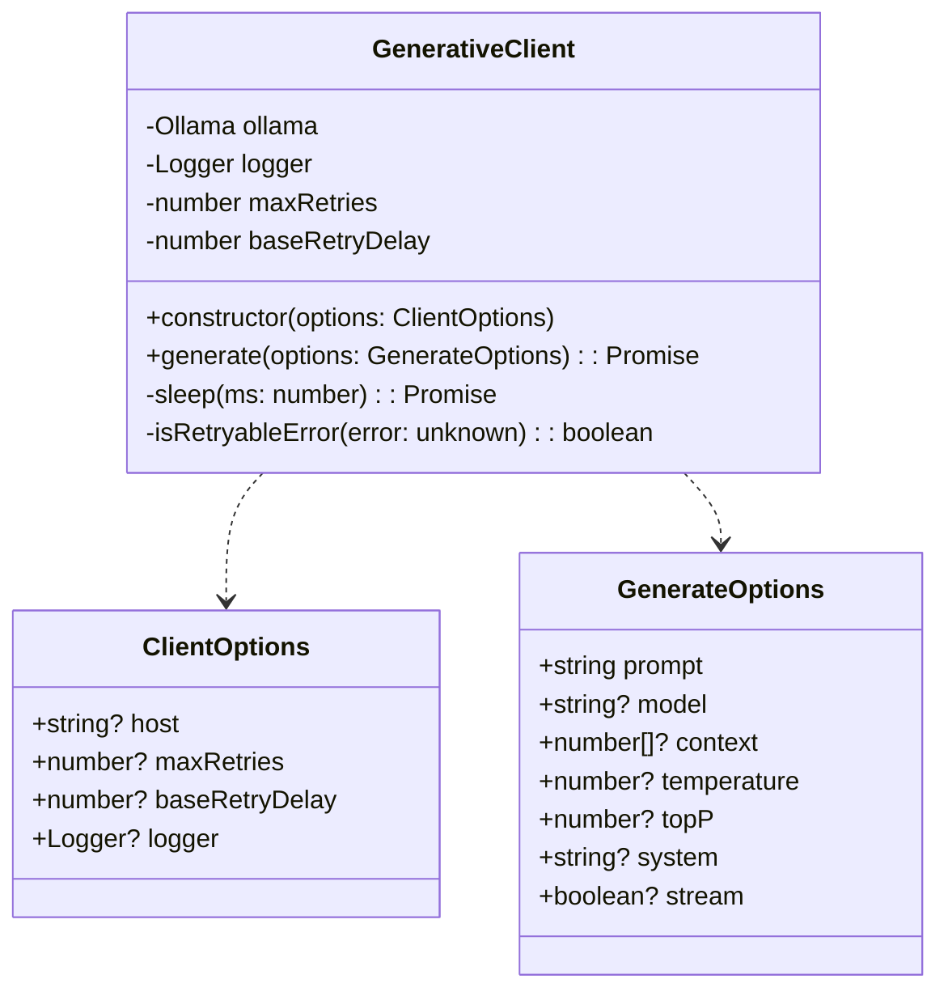
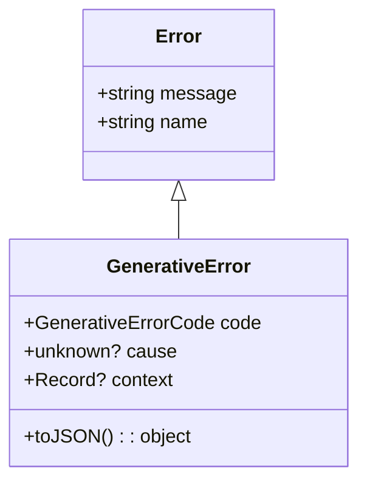
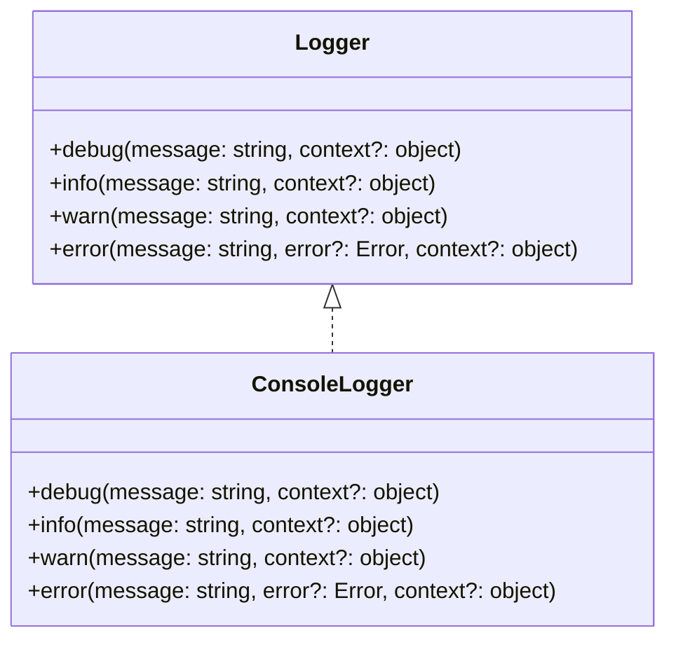
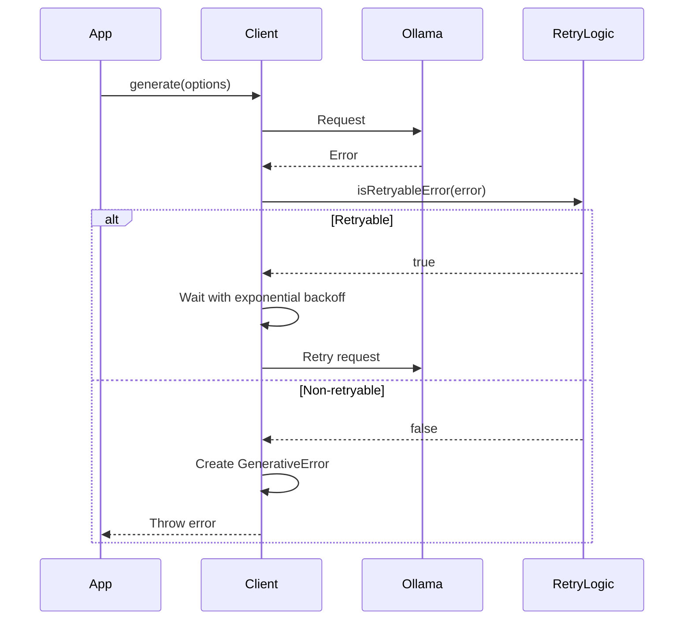

# Architecture

This document describes the technical architecture of the @desirecraftai/generative package.

## Overview

The package is designed with the following principles:

- Clean separation of concerns
- Type safety and validation
- Robust error handling
- Extensible logging
- Performance optimization

## Core Components

### GenerativeClient

The main client class that handles:

- Connection management with Ollama
- Request validation and processing
- Error handling and retries
- Streaming support
- Performance monitoring



### Error Handling

A hierarchical error system:



### Logging System

Flexible logging architecture:



## Request Flow

1. **Initialization**

   ```mermaid
   sequenceDiagram
       participant App
       participant Client
       participant Ollama
       App->>Client: new GenerativeClient(options)
       Client->>Ollama: Connect
       Ollama-->>Client: Connected
       Client-->>App: Ready
   ```

2. **Generation Request**

   ```mermaid
   sequenceDiagram
       participant App
       participant Client
       participant Validator
       participant Ollama
       App->>Client: generate(options)
       Client->>Validator: validateGenerateOptions(options)
       Validator-->>Client: validatedOptions
       Client->>Ollama: generate(request)
       Ollama-->>Client: response
       Client-->>App: result
   ```

3. **Streaming Request**
   ```mermaid
   sequenceDiagram
       participant App
       participant Client
       participant Ollama
       participant Handler
       App->>Client: generate(options, streamHandler)
       Client->>Ollama: generate(request, stream: true)
       loop For each token
           Ollama-->>Client: token
           Client->>Handler: onToken(token)
       end
       Client->>Handler: onComplete(response)
       Client-->>App: fullResponse
   ```

## Error Flow



## Performance Considerations

1. **Memory Management**

   - Context tokens are managed efficiently
   - Streaming reduces memory footprint
   - Resources are cleaned up properly

2. **Network Optimization**

   - Retries with exponential backoff
   - Connection reuse
   - Efficient error handling

3. **Validation**
   - Input validation before requests
   - Type checking at compile time
   - Runtime schema validation

## Future Extensions

The architecture is designed to be extensible for:

- Additional LLM providers
- Caching layers
- Request batching
- Model management
- Advanced monitoring
